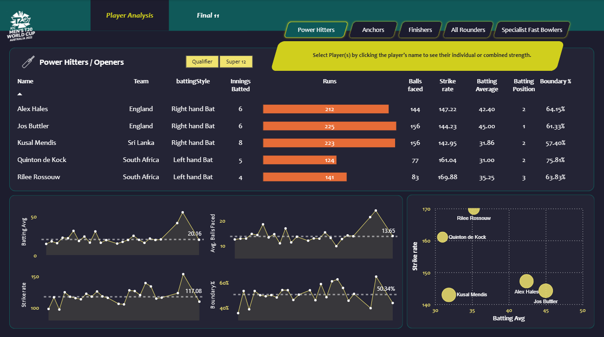
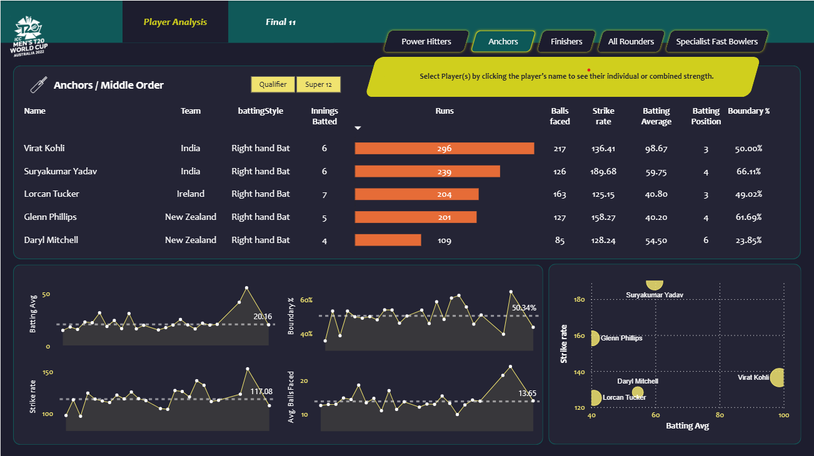
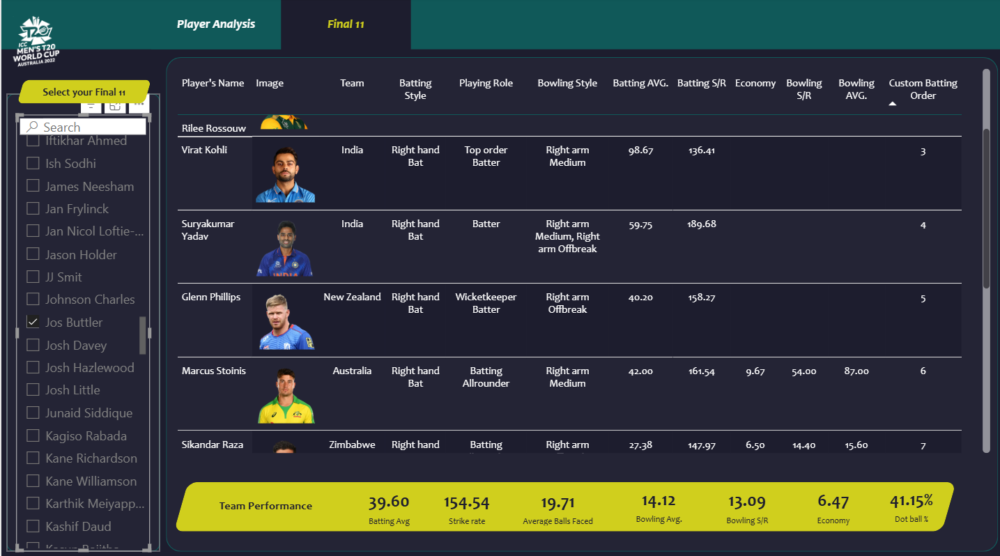

# 🏏 T20 Cricket Data Analytics Project

## 📌 Overview
This project performs end-to-end data analytics on T20 World Cup cricket data. It includes data scraping, cleaning, transformation, and visualization to derive actionable insights on player and team performance.

## 🎯 Problem Statement
The objective is to:
- Identify top-performing players across roles
- Build an optimal playing XI
- Analyze match-winning patterns and strategies

## 🛠️ Tech Stack
- Python (Pandas, NumPy, BeautifulSoup)
- Web Scraping
- Power BI
- Jupyter Notebook

## 📊 Dashboard Preview

## 🌐 Live Dashboard
(Add your Power BI link here)

## 📁 Project Structure
- `data/` → Raw & processed datasets  
- `src/` → Python scripts for scraping & preprocessing  
- `notebooks/` → Data analysis notebooks  
- `dashboards/` → Power BI dashboard  
 

## 🚀 Key Insights
- Top-order batsmen contribute majority of runs
- Death-over bowlers significantly impact match outcomes
- Balanced teams with all-rounders perform better

## 🙏 Acknowledgement
This project is inspired by learning resources including Codebasics (Dhaval Patel) YouTube series.  
The implementation, analysis, and dashboard design have been independently developed and enhanced.
